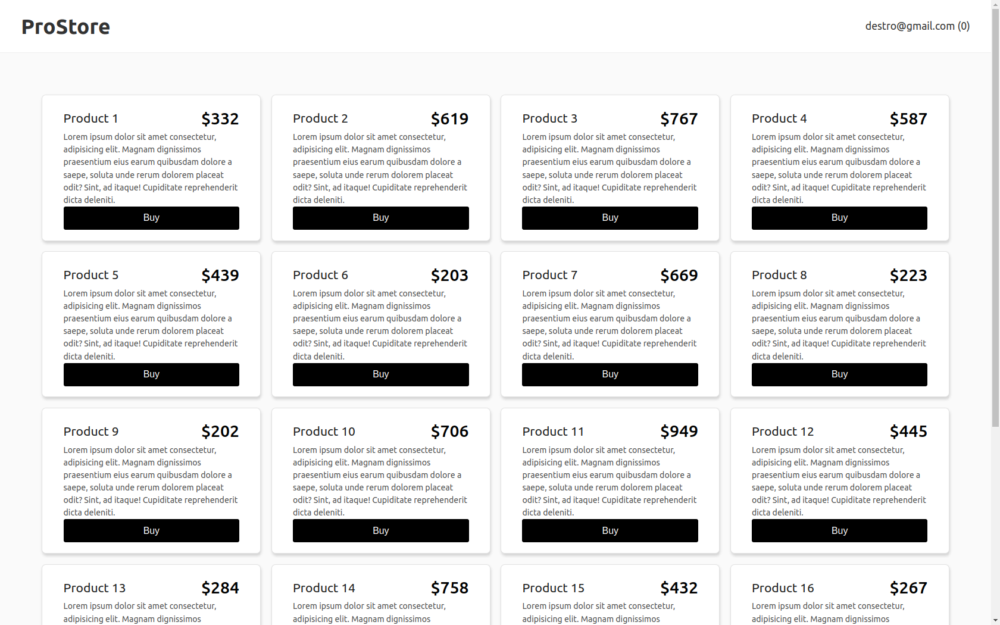

# ProStore - Clean Architecture Frontend

Este repositório tem como objetivo demonstrar a utilização da **Clean Architecture** no desenvolvimento de uma aplicação **frontend** usando **React**.
 
A aplicação simula um sistema de loja online, onde o usuário pode navegar pelos produtos, adicionar ao carrinho, fazer pedidos, realizar autenticação e finalizar o **checkout** (fazer a compra).

## Objetivo
O objetivo deste projeto é mostrar como organizar uma aplicação React utilizando a **Clean Architecture**, que separa as responsabilidades em camadas distintas (bem mais além do que simples organização de directórios), permitindo maior **manutenibilidade**, **testabilidade** e **escalabilidade**. A arquitetura é composta pelas seguintes camadas principais:
- **Domain**: contém a lógica de negócio e as entidades.
- **Application**: contém os casos de uso e serviços que orquestram a lógica de negócios.
- **Infrastructure**: implementa as interfaces de acesso a recursos externos, como APIs e armazenamento local.
- **Presentation (UI)**: contém os componentes React que gerenciam a interface do usuário e as interações com a aplicação.

## Estrutura do Projeto

O projeto segue uma estrutura de pastas baseada nas camadas da Clean Architecture, como descrito abaixo:

```
/src
  /application
    /ports                     # Interfaces/ports que definem contratos (casos de uso)
    /services                  # Serviços de aplicação que orquestram os casos de uso
    /useCases                  # Casos de uso
  /domain
    /entities                  # Entidades de domínio
	/repositories              # Interfaces que define os repositórios
  /infrastructure
    /repositories              # Implementações concretas dos repositórios
    /services                  # Serviços concretos que interagem com recursos externos
    /utils                     # Utilitários da cada de infraestrutura
  /presentation
    /components                # Componentes de UI
    /hooks                     # Hooks que consomem os serviços de aplicação
    /layout                    # Layouts da aplicação
    /pages                     # Páginas da aplicação
    /stores                    # Estados compartilhados
```


### Camadas

#### 1. **Domain**
Esta camada contém as entidades que representam os objetos do negócio. No caso desta aplicação, temos **Produto**, **Carrinho** e **Pedido** como as entidades principais, com a lógica de manipulação de produtos, itens do carrinho e finalização do pedido.

- **Product**: representa um produto.
- **Cart**: representa o carrinho de compras.
- **Order**: representa um pedido.
- **User**: representa um utilizador.

#### 2. **Application**
Esta camada contém a lógica de casos de uso e serviços que orquestram a interação entre o domínio e a infraestrutura.
- Lógica de adicionar itens no carrinho, bem como calcular o total.
- Autenticação do usuário.
- Processo de checkout e a criação do pedido.
- Acesso aos produtos.
- etc;

#### 3. **Infrastructure**
Esta camada fornece as implementações concretas das interfaces da camada **Application**. Esta camada interage com recursos externos, como APIs e armazenamento local.

#### 4. **Presentation**
A camada **Presentation** é responsável pela interface de usuário (UI) da aplicação.

## Tecnologias utilizadas

- **React**
- **Vite**
- **JavaScript/ES6**: Linguagem de programação principal.
- **Typescript**
- [**@bentoo/state-man**](https://www.npmjs.com/package/@bentoo/state-man) - para gerenciamento de estados

## Como rodar o projeto

Para rodar a aplicação localmente, siga os passos abaixo:

### 1. Clone o repositório:

```bash
git clone https://github.com/manuelbento19/frontend-clean-arch.git
cd frontend-clean-arch
```
### 2. Instale as dependências:

```bash
npm install
```
### 3. Inicie o servidor:
```bash
npm run dev
```

O aplicativo estará disponível em [http://localhost:5173](http://localhost:5173/).

## Funcionalidades
A aplicação possui as seguintes funcionalidades principais:
- **Listagem de produtos**: exibe uma lista de produtos disponíveis para compra.
- **Carrinho de compras**: o usuário pode adicionar produtos ao carrinho e ver o total de sua compra.
- **Autenticação**: O usuário pode realizar o login para acessar funcionalidades restritas.
- **Checkout**: O usuário pode revisar os itens do carrinho e finalizar a compra. Após o pagamento, o pedido é processado e confirmado.

### Fluxo do checkout
1. **Adicionar itens ao carrinho**
2. **Revisar pedido**
3. **Pagamento**
4. **Confirmação de pedido**

## Contribuindo
1. Fork este repositório.
2. Crie uma nova branch (`git checkout -b feature/nova-funcionalidade`).
3. Faça suas alterações e commit (`git commit -am 'feat: nova funcionalidade'`).
4. Push para a branch (`git push origin feature/nova-funcionalidade`).
5. Abra um pull request.

## Licença
Este projeto está licenciado sob a [MIT License](./LICENSE).